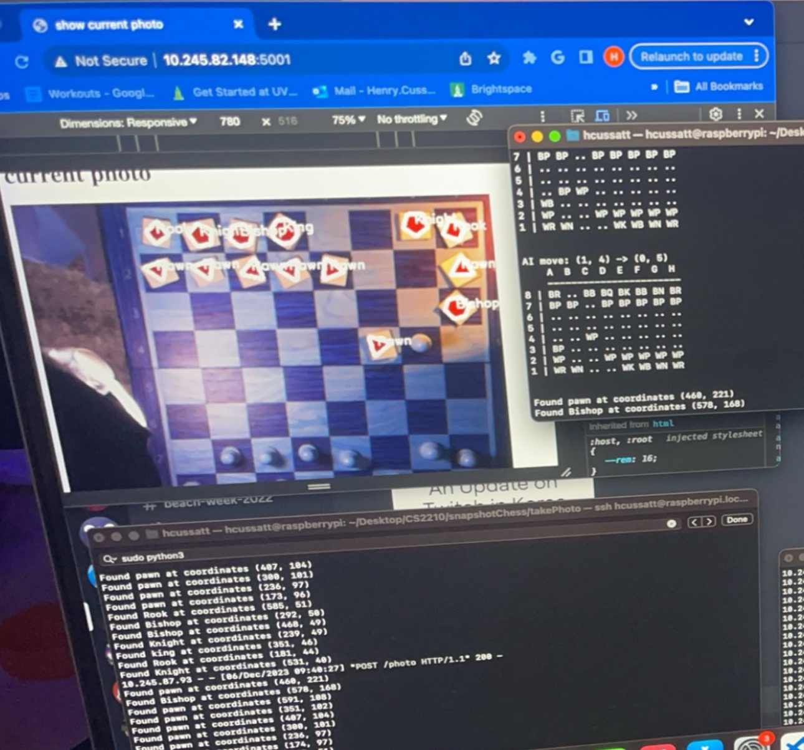

# Snapshot Chess
Snapshot Chess was created by Henry Cussatt as a final project for UVM's CS 2210 - Computer Organization
This project utilizes an existing Python Chess engine created by github user [Dirk94](https://github.com/Dirk94/ChessAI)

Project development took place over the course of a week, building both a tower to mount the camera and a tower to mount a light at a specific angle from recycled cardboard. 

Project writeup took the form as a project proposal, designed to emulate what could theoretically be pitched to an investor (in this case, the class professor.) [Read full report](https://docs.google.com/document/d/1RcrZxla1AI3HLU2bOPX8a3ewCGfuCZdZzUAA7nGK7hU/edit?usp=sharing)

Project was designed to be uploaded and ran from an Raspberry Pi connected to a camera affixed to a cardboard tower to have a proper/clear view of the chess board. Through the use of photo processing, an image will be taken of the chessboard after every move, and the position of all pieces will be routed through a specialized algorithm in order to determine the best possible move for the computer player to make. The game will be interfaced via the terminal displayed on a computer, where they are instructed to move the computer’s piece accordingly. There will also be two Flask apps running that allow for further player input. The player will be able to select a picture to use that confirms their movement and the proper identification of their turn.

> Screenshot of demo run with recognized pieces midgame

Project was presented at the 2023 UVM CS Fair

> Picture of Henry Cussat standing beside finished project

